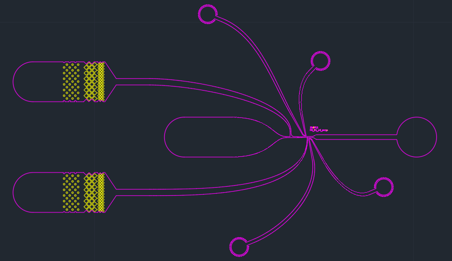

<!-- README.md is generated from README.Rmd. Please edit that file -->

The goal of this package is to implement analysis scripts and document
calculations and estimations used for the development of a microfluidic
picoinjector.

<!--  -->

## Installation

You can install the development version of picoinjector from
[GitHub](https://github.com/) with:

``` r
# install.packages("devtools")
devtools::install_github("fynnwi/picoinjector")
```

## Content

1.  Calculations to estimate hydraulic resistances in PTFE and Tygon
    tubing and the resulting flow rates:
    `vignette("hydraulic_resistance")`
2.  Estimations to quantify the number of droplets contained in x cm of
    tubing: `vignette("droplet_volumes")`
3.  Spin curve analysis of SU-8 3035 custom dilution:
    `vignette("spincurves")`

| Content                                                                                           |                                      |
|---------------------------------------------------------------------------------------------------|--------------------------------------|
| Calculations to estimate volume and concentration in tubing, droplets, and cells                  | `vignette("volumes")`                |
| Estimates for hydraulic resistance, flow rate, and pressure drop in microfluidic channels         | `vignette("hydraulic_resistance")`   |
| Functions to import and visualize Elveflow OB1 and CETONI syring pump log files                   | `vignette("logfiles")`               |
| Dektak profilometry data analysis to estimate spin coating behaviour of SU-8 3035 custom dilution | `vignette("spincurves")`             |
| Analysis of Nyancat data                                                                          | `vignette("fads_analysis")`          |
| Linear regression of voltage amplifier output for different input amplitudes and frequencies      | `vignette("electrical_engineering")` |
