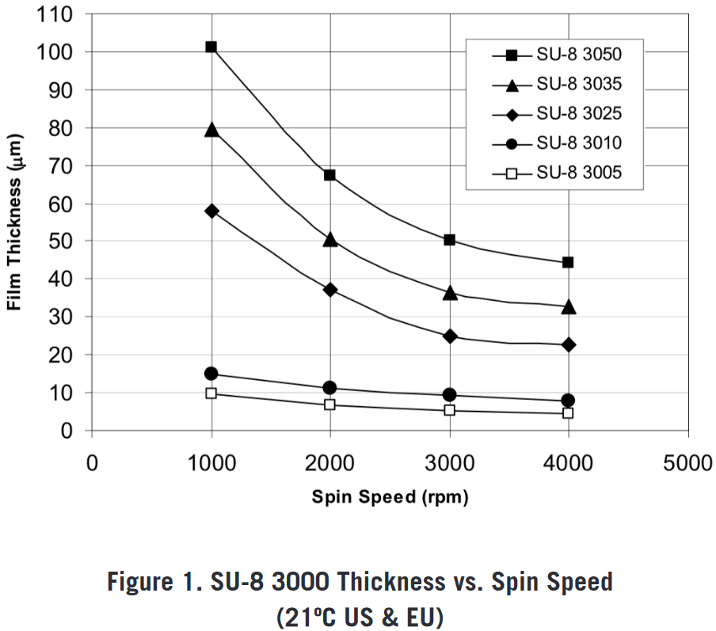

```{r, include = FALSE}
knitr::opts_chunk$set(
  collapse = TRUE,
  comment = "#>",
  eval = FALSE
)
```


<!-- To do: -->

<!-- - change units to um and mm -->


## introduction

For my microfluidic chips, channel heights in the range of 20-30 um are desired.
To obtain these heights during the photolithography process, a photoresist with suitable viscosity is required.
{ width=50% } 

These are the spin curves for the SU-8 3000 series [@noauthor_su-8_nodate].
It seems like SU-8 3035 can yield thicknesses in the desired range (extrapolating for higher RPMs, and from the experience that at 6000 RPM 30 um thickness can be achieved with SU-8 3050).
Therefore, 115.2 g SU-8 3050 was mixed with 1.42 g of thinner solution, in order to obtain a custom dilution that mimics the behaviour of SU-8 3035.
In the following, SU-8 3035 refers to this custom dilution.

After preparation of SU-8 3035, a spin curve analysis was conducted to characterize the relation between spin speed and film thickness of the custom photoresist.
To that end, a cross pattern (see image) was exposed on cleaned and re-used silicon wafers, after spin-coating SU-8 3035 at 3000, 4000, and 5000 RPM, respectively.
For each of these RPM, three chips were prepared: two chips using a spin duration of 30s (to have duplicate measurements), and one chip using a spin duration of 60 s.
Therefore, in total, nine wafers were prepared.

{ width=50% }
{ width=50% }

After photolithography, the resulting height profiles were measured using a Dektak profilometer.
Unfortunately, when measuring over long distances with this machine, measurements are drifting away from the reference level quite significantly, which necessitates a correction before data evalutation.
Therefore, the cross structure exposed on the wafer includes repeated gaps in order to pick up the zero-level along the entire wafer.

These are the wafer ids corresponding to a certain combination of spin time and spin speed:

| spin time / RPM | 3000             | 4000             | 5000             |
|-----------------|------------------|------------------|------------------|
| 30 s            | job9945, job9946 | job9947, job9948 | job9949, job9950 |
| 60 s            | job10055         | job10053         | job10054         |

For each wafer, four traces were measured: top-to-bottom, left-to-right, bottom-to-top, and right-to-left (see figure).
This results in duplicate measurements for all the structures.

In this vignette, the post-processing and drift correction of the Dektak data will be carried out.
This includes:

- reading in CSV files,
- recognition of the reference level segments,
- drift correction,
- averaging of duplicate measurements,
- interpolation of height profiles between the gaps in the structure.


```{r setup}
library(picoinjector)
library(dplyr)
library(tibble)
library(readr)
library(stringr)
library(ggplot2)
# library(tidyr)
```


## data loading

Get file names:

```{r}
files <- list.files("data/spincurve_csv/", full.names = TRUE)
head(files)
```


Read in all the csv files and concatenate them into a single tibble dataframe:

```{r}
results <- tibble()
for (f in files) {
  d <- read_csv(f, skip = 19, show_col_types = FALSE, col_names = c("position", "height")) %>% 
    select(position, height) %>% 
    mutate(id = basename(f)) # add the wafer id
  results <- bind_rows(results, d)
}
results
```

Add information about spin speed and duration:

```{r}
# table relating wafer id with RPM
rpm <- c(job9945 = 3000, job9946 = 3000, job9947 = 4000, job9948 = 4000,
         job9949 = 5000, job9950 = 5000, job10053 = 4000, job10054 = 5000, job10055 = 3000)

# table relating wafer id with seconds at max RPM
spinTime <- c(job9945 = 30, job9946 = 30, job9947 = 30, job9948 = 30,
         job9949 = 30, job9950 = 30, job10053 = 60, job10054 = 60, job10055 = 60)

results <- results %>% 
  mutate(wafer = str_extract(id, "job\\d+"),
         direction = str_extract(id, "[a-z]+\\.") %>% 
           str_remove("\\."),
         orientation = case_when(direction %in% c("eastwest", "westeast") ~ "horizontal",
                                 TRUE ~ "vertical"),
         rpm = rpm[wafer],
         spintime = spinTime[wafer]) %>% 
  # order rows by wafer, direction and position
  group_by(rpm, spintime, direction) %>% 
  arrange(rpm, spintime, .by_group = TRUE) %>% 
  ungroup()
results
```


The raw data looks like this:

```{r}
profile <- results %>% 
  # filter for single trace
  filter(id == "00_job9945_eastwest.csv")

plot_heightprofile(profile)
```
```{r, include=FALSE, eval=FALSE}
plot_heightprofile(profile) +
  theme_void()
ggsave("output/plots/03_dektak_profile_raw.png", width = 3, height = 1.5, dpi = 300)
```


## baseline correction

Now I use the geometrical information of my design to determine peaks and valleys in the trace.
First, I find the positions (x coordinate) of the leftmost and rightmost structure using the slope of the graph, and then I rescale everything so that it spans the known width of 40.5 mm that was written on the wafer.
The rescaling is necessary in case the trace was not perfectly aligned with the structure, i.e. slightly diagonal and therefore a little bit longer.

```{r}
profile %>% 
  filter(position < 1000) %>% # zoom at left-most peak
  plot_heightprofile()
```


To find the x coordinate were the first structure begins, I calculate the first derivative of the height profile (lagged differences) in order to identify regions with large slope.
The first derivative of above graph then looks like this:

```{r}
# lagged differences parameters
lag <- 10
dif <- 1
offset <- dif * lag

# calculate derivative
derivative <- tibble(
  "d_height" = diff(profile$height, lag = lag, differences = dif) / diff(profile$position, lag = lag, differences = dif),
  # adjust dimension of x axis (lagging difference removes the first l elements):
  "position" = profile$position[(offset+1):length(profile$position)]
)

derivative %>% 
  filter(position < 1000) %>% # zoom to first structure
  ggplot(aes(x = position, y = d_height)) +
  geom_line() + 
  labs(title = "Derivative of height profile",
       subtitle = paste("Lag =", lag, ", difference order =", dif),
       x = "Lateral position [um]",
       y = "Lagged difference magnitude") + 
  theme_pretty()
```

The `lag` parameter defines the sliding window size that should be used for difference calculation and can be used to smooth the resulting derivative plot.
For the remainder of this analysis, I will use `lag = 10`.


This function finds the index of the first edge of the height profile, which should correspond to the edge of the first structure on the wafer (left-to-right).
The x coordinate where the derivative first exceeds a give threshold `minSlope` is identified as an edge.
For this analysis I am using `minSlope = 500`.

```{r}
get_index_first_peak <- function(values, minSlope) {
  # find the first maximum
  i <- 1
  while (TRUE) {
    if (values[i] > minSlope) {
      return(i)
    }
    i <- i+1
  }
}
get_index_first_peak(derivative$d_height, 500)
```

Now above defined function can be used to determine the start and end coordinate of a profile.
Using this information, the total length of a profile can be rescaled to cover 40.5 mm which is known from the initial AutoCAD design.
This function detects the beginning and end of the height profile and then rescales the corresponding lateral position

```{r}
rescale_profile <- function(profile, lag, minSlope) {
  # calculate derivative of height w.r.t. position
  dHeight <- diff(profile[["height"]], lag = lag) / diff(profile[["position"]], lag = lag)
  # get index of first peak
  first <- get_index_first_peak(dHeight, minSlope)
  # get index of last peak
  last <- get_index_first_peak(rev(dHeight)* (-1), minSlope)
  
  # convert indices into corresponding position value
  posFirst <- profile[["position"]][first + lag]
  posLast <- rev(profile[["position"]])[last]
  
  # rescale everything: distance between first and last position should be exactly 45mm
  # discard data outside of the interval
  profile[(first + lag):(nrow(profile)-last), ] %>% 
    mutate(position = seq(0, 40500, length.out = n())) %>% 
    return()
}
```

A rescaled profile then looks like this. 
Note how the beginning and end are truncated, compared to the plot of the same trace shown above.

```{r}
profileRescaled <- profile %>% 
  rescale_profile(lag = 10, minSlope = 500)

plot_heightprofile(profileRescaled)
```


Next, the geometrical information known from the AutoCAD design can be used to identify the peaks and valleys present in the design.
At the valleys, the height profile is then sampled at discrete points in order to capture the baseline shift.
These discrete baseline points will later be used to fit a continuous baseline curve.

```{r}
get_baseline_points <- function(profile) {
  # sample points to capture the baseline
  samplePoints <- seq(750, 40500, by = 1000)
  # exclude center region (has no gap)
  samplePoints <- samplePoints[samplePoints < 19000 | samplePoints > 21500]
  xIndices <- sapply(samplePoints, function(x,y) which.min(abs(x-y)), profile[["position"]])
  
  # return baseline points
  tibble("position" = profile[["position"]][xIndices],
         "height" = profile[["height"]][xIndices]) %>% 
    return()
}
```

The sampled baseline data points look like this:

```{r}
baselinePoints <- profileRescaled %>% 
  get_baseline_points()

baselinePoints

profileRescaled %>% 
  plot_heightprofile() +
  geom_point(data = baselinePoints, shape = 23, color = "firebrick1")
```

Use LOESS regression to fit curve to the baseline data points:

```{r}
baseline_regression <- function(profile, baselinePoints, loessSpan) {
  # LOESS regression to fit a function to the baseline data points
  loessModel <- loess(height ~ position, data = baselinePoints, span = loessSpan)
  
  # extrapolate
  profile %>% 
    mutate("baseline" = predict(loessModel, position)) %>% 
    return()
}
```

Regression of the baseline points looks like this:

```{r}
profileRescaled %>% 
  baseline_regression(baselinePoints, loessSpan = 0.2) %>% 
  plot_heightprofile() +
  geom_line(aes(y = baseline), color = "firebrick2")
```

Note: loess regression doesn't allow extrapolation, removes leftmost and rightmost data points.

The regression line can the be subtracted from the height data in order to level all the valleys to zero.

```{r}
subtract_baseline <- function(profile) {
  profile %>% 
    mutate(height = height - baseline) %>% 
    filter(!is.na(height)) %>% 
    select(!baseline) %>% 
    return()
}

profileRescaled %>% 
  baseline_regression(baselinePoints, loessSpan = 0.2) %>% 
  subtract_baseline() %>% 
  plot_heightprofile() 
```

```{r, include=FALSE, eval=FALSE}
profileRescaled %>% 
  baseline_regression(baselinePoints, loessSpan = 0.2) %>% 
  subtract_baseline() %>% 
  plot_heightprofile()  +
  # theme_pretty_thesis() + 
  theme_void()
  # theme(axis.title = element_blank(),
  #       axis.text = element_blank())
ggsave("output/plots/03_dektak_profile_corrected.png", width = 3, height = 1.5, dpi = 300)
```


This function combines all the steps:

```{r}
baseline_correction <- function(profile) {
  # lag and minSlope are hardcoded in here!
  rescaled <- profile %>% 
    rescale_profile(10, 500)
  
  baselinePoints <- rescaled %>% 
    get_baseline_points()
  
  rescaled %>% 
    baseline_regression(baselinePoints, 0.2) %>% 
    subtract_baseline() %>% 
    return()
}
```


Iterate over all the traces and correct for baseline shift:

```{r}
resultsCorrected <- tibble()
for (traceId in unique(results$id)) {
  corrected <- results %>% 
    filter(id == traceId) %>% 
    baseline_correction()
  resultsCorrected <- bind_rows(resultsCorrected, corrected)
}
```


This function can be used to plot the baseline-corrected profiles for every wafer:

```{r, fig.width=10, fig.height=10}
p <- plot_heightprofile_bywafer(resultsCorrected)
print(p)
```

As can be seen in this overview plot, the baseline correction method seems to work for all the profiles.


## post-processing

The next step in the analysis is to summarize the duplicate measurements that exist for every structure, and interpolate the height profile across the gaps, in order to obtain a comprehensive plot that describes the spin coating thickness as a function of the radial distance from the wafer center, as well as RPM and spin time.

Function that removes the baseline segments of the data using the known locations of valleys in the structure, and interpolating those values from the surrounding data:

```{r}
# Geometrically, a valley is 500 um wide. Set to a larger value than that to filter out overshoots in the signal at the edges
interpolate_valleys <- function(profile, width = 650) {
  
  ## 1. remove gap data
  # the baseline centers are supposed to be located right in the middle of the valleys
  baselineCenters <- seq(-250, 42000, by = 1000)
  # exclude middle region
  # baselineCenters <- baselineCenters[baselineCenters < 19000 | baselineCenters > 21500]
  baselinePositions <- sapply(baselineCenters, function(x) seq(x-0.5*width, x + 0.5*width)) %>% 
    as.numeric()
  
  positionsRounded <- round(profile[["position"]])
  idx <- !positionsRounded %in% baselinePositions
  
  positions <- profile$position[idx]
  height <- profile$height[idx]
  
  ## 2. interpolate between gaps
  a <- approx(positions, height, profile$position)
  
  profile %>% 
    mutate(height = a$y) %>% 
    filter(!is.na(height)) %>% 
    return()
}
```

The resulting height profile does not contain gaps anymore:

```{r}
resultsCorrected %>% 
  filter(id == "00_job9945_eastwest.csv") %>% 
  interpolate_valleys() %>% 
  plot_heightprofile() + 
  ylim(c(0, 50000))
```


```{r, include=FALSE, eval=FALSE}
 resultsCorrected %>% 
  filter(id == "00_job9945_eastwest.csv") %>% 
  interpolate_valleys() %>% 
  plot_heightprofile() + 
  ylim(c(0, 50000))+ 
  theme_pretty_thesis() + 
  theme(axis.title = element_blank(),
        axis.text = element_blank())
ggsave("output/plots/03_dektak_profile_interpolated.png", width = 3, height = 1.5, dpi = 300)
```


Do this for all traces and show them in a single plot:

```{r, fig.width=10, fig.height=10}
resultsInterpolated <- tibble()
for (traceId in unique(resultsCorrected$id)) {
  r <- resultsCorrected %>% 
    filter(id == traceId) %>% 
    interpolate_valleys()
  resultsInterpolated <- bind_rows(resultsInterpolated, r)
}
```


```{r, fig.width=10, fig.height=10}
ggplot(resultsInterpolated, aes(x = position, y = height, color = direction)) + 
  geom_line() + 
  geom_hline(yintercept = 0) + 
  facet_wrap(~ wafer) + 
  theme_pretty() + 
  labs(x = "Lateral position [um]",
       y = "Height [nm]",
       color = "Trace")
```


```{r}
# resultsInterpolated %>% 
  # mutate(position = position - 0.5 * max(position) - 0.5 * min(position))
# position = position - 0.5 * max(position) - 0.5 * min(position)
```


```{r}
c <- min(resultsInterpolated$position) + 0.5 * abs(max(resultsInterpolated$position) - min(resultsInterpolated$position))
resultsInterpolated %>% 
  filter(wafer == "job9945") %>% 
ggplot(aes(x = position, y = height, group = direction)) + 
  geom_line(linewidth = 0.5) + 
  geom_hline(yintercept = 0, linetype = "dashed", linewidth = 0.5) +
  geom_vline(xintercept = c, linetype = "dashed", linewidth = 0.5) + 
  theme_pretty() + 
  labs(x = "Lateral position [um]",
       y = "Height [nm]",
       color = "Trace") + 
  # theme_pretty_thesis() + 
  theme_void()  
  # theme(axis.title = element_blank(),
  #       axis.text = element_blank())
ggsave("output/plots/03_dektak_profile_interpolated.png", width = 3, height = 1.5, dpi = 300)
```


For each wafer, four traces were measured, of which pairs of two should be identical to each other: trace south-north measures the same structure as north-south, and the same is true for traces east-west and west-east.
In above graph, this similarity is not obvious, because the measurement directions are reversed (west-east goes left-to-right and east-west the other way around).
Therefore, two of the four traces have to be reversed, so that the only measurement directions are _top-to-bottom_ and _left-to-right_.
Furthermore, the data will be centered around zero, so that the origin is located in the wafer center.


```{r}
mirror_and_center <- function(resultsInterpolated) {
  resultsInterpolated %>% 
    group_by(wafer, direction) %>% 
    arrange(position, .by_group = TRUE) %>% 
    mutate(height = case_when(direction %in% c("southnorth", "eastwest") ~ rev(height),
                                        TRUE ~ height)) %>% 
    # center around zero
    mutate(position = position - 0.5 * max(position) - 0.5 * min(position)) %>% 
    ungroup() %>% 
    return()
}
```


Now there is a lot more similarity going on in the height profiles.
Of the four traces, those in horizontal and vertical direction, respectively, should be overlapping to a large degree.

```{r, fig.width=10, fig.height=10}
heights <- resultsInterpolated %>% 
  mirror_and_center()

ggplot(heights, aes(x = position, y = height, color = direction)) + 
  geom_line() + 
  geom_hline(yintercept = 0) + 
  facet_wrap(~ wafer) + 
  theme_pretty() + 
  labs(x = "Lateral position [um]",
       y = "Height [nm]",
       color = "Trace")
```

For a single wafer:

```{r}
heights %>% 
  filter(wafer == "job9946") %>% 
  ggplot(aes(x = position, y = height, color = direction)) + 
  geom_line() + 
  geom_hline(yintercept = 0) + 
  theme_pretty() + 
  labs(x = "Position from wafer center [um]",
       y = "Height [nm]",
       color = "Trace direction")
```


The duplicate measurements of the horizontal and vertical structure will be averaged.

```{r}
average_duplicate_traces <- function(heights) {
  heights %>% 
    mutate(position = round(position)) %>% 
    group_by(rpm, wafer, spintime, orientation, position) %>% 
    summarise(height = round(mean(height)),
              height_sd = sd(height),
              .groups = "drop") %>% 
    return()
}
```


```{r, fig.width=10, fig.height=10}
heights <- heights %>% 
  average_duplicate_traces()

heights %>% 
  ggplot(aes(x = position, y = height, color = orientation)) + 
  geom_line() + 
  geom_hline(yintercept = 0) + 
  theme_pretty() + 
  labs(x = "Position from wafer center [um]",
       y = "Height [nm]",
       color = "Trace direction") + 
  facet_wrap(~ wafer)
```


Finally, since the spin coating process should be radially symmetrical more or less (ideally), I want to describe the height profile as a function of the radial distance from the wafer center.
To that end, data with negative position coordinate will be flipped over into the positive range.

 { width=50% }


```{r}
make_radial <- function(heights) {
  heights %>% 
    mutate(quadrant = case_when(orientation == "vertical" & position < 0 ~ "south",
                                orientation == "vertical" & position >= 0 ~ "north",
                                orientation == "horizontal" & position < 0 ~ "west",
                                orientation == "horizontal" & position >= 0 ~ "east",
                                TRUE ~ "ERROR")) %>% 
    # flip values with negative position coordinate into positive range
    mutate(position = case_when(position < 0 ~ -position,
                                TRUE ~ position)) %>% 
    ungroup() %>% 
    return()
}

heightsRadial <- heights %>% 
  make_radial()
```


```{r, fig.width=10, fig.height=10}
ggplot(heightsRadial, aes(x = position, y = height, color = quadrant)) + 
  geom_line() + 
  geom_hline(yintercept = 0) + 
  facet_wrap(~ wafer) + 
  theme_pretty() + 
  labs(x = "Distance from wafer center [um]",
       y = "Height [nm]",
       color = "Quadrant")
```

```{r, include=FALSE, eval=FALSE}
heightsRadial %>% 
  filter(wafer == "job9946") %>% 
  ggplot(aes(x = position, y = height, group = quadrant)) + 
  geom_line(linewidth = 0.5) + 
  geom_hline(yintercept = 0, linetype = "dashed", linewidth = 0.5) + 
  geom_vline(xintercept = 0, linetype = "dashed", linewidth = 0.5) + 
  theme_pretty() + 
  labs(x = "Distance from wafer center [um]",
       y = "Height [nm]",
       color = "Quadrant") +   
  theme_void()
ggsave("output/plots/03_dektak_profile_flipped.png", width = 3, height = 1.5, dpi = 300)

```


Plot by RPM and spintime:


```{r}
for (r in unique(heightsRadial$rpm)) {
  p <- heightsRadial %>% 
    filter(rpm == r) %>% 
    ggplot(aes(x = position*1e-3, y = height*1e-3, color = wafer)) + 
    geom_vline(xintercept = 25.4, linetype = "dashed") +
    geom_line(aes(group = interaction(wafer, quadrant), linetype = factor(spintime)), linewidth = 0.5, alpha = 0.7) + 
    labs(x = "Distance from wafer center [mm]",
         y = "Coating thickness [um]",
         linetype = "Spintime [s]",
         color = "Wafer id",
         title = paste(r, "RPM")) + 
    scale_color_viridis_d() + 
    theme_pretty() + 
    ylim(c(0, 60))
  print(p)
}
```


```{r}
waferNames <- heightsRadial %>% 
  group_by(rpm, wafer) %>% 
  summarise(.groups="drop") %>% 
mutate("colorVar" = paste0("Wafer ", rep(c(1,2,3), 3)))
waferNames
```


```{r, fig.width=9.31, fig.height=3.39}
library(wesanderson)
pal <- wes_palette("Zissou1")
heightsRadial %>% 
  left_join(waferNames, by = c("rpm", "wafer")) %>% 
  mutate("rpm" = paste(rpm, "rpm"),
         "spintime" = paste(spintime, "s")) %>% 
  ggplot(aes(x = position*1e-3, y = height*1e-3)) + 
    geom_vline(xintercept = 25.4, linetype = "dashed", color = "#999999") +
  geom_line(aes(group = interaction(wafer, quadrant), linetype = spintime, color = colorVar)) + 
  facet_wrap(~ rpm, nrow = 1, scales = "free_y") + 
  
  theme_pretty_thesis()+
  scale_color_manual(values = wes_palette("Darjeeling1")) + 
  coord_cartesian(expand = FALSE) +
    ylim(c(0, 60)) + 
  xlim(c(0, 26)) + 
    labs(x = "Distance from wafer center [mm]",
         y = "Coating thickness [µm]",
         linetype = "Spin duration",
         color = "Replicate",
         title = "SU-8 3035* film thickness vs. spin speed and duration",
         subtitle = "Dashed lines indicate wafer boundary") + 
  theme(legend.background = element_blank(),
        # legend.position = c(0,0), legend.justification = c(0,0), legend.direction = "horizontal",
        legend.position = "bottom",
        legend.box.margin = margin(),
        legend.box.just = "right", legend.margin = margin())
  
```

```{r, fig.width=9.31, fig.height=3.39}
ggsave("output/plots/04_spincurves.png", dpi = 300, width =9.31, height = 3.39)
ggsave("output/plots/04_spincurves.pdf", width = 6.2, height = 6.2/3)
```


Thesis plot:

```{r}
heightsRadial %>% 
  left_join(waferNames, by = c("rpm", "wafer")) %>% 
  mutate("rpm" = paste(rpm, "rpm"),
         "spintime" = paste(spintime, "s")) %>% 
  ggplot(aes(x = position*1e-3, y = height*1e-3)) + 
    geom_vline(xintercept = 25.4, linetype = "dashed", color = "#999999") +
  geom_line(aes(group = interaction(wafer, quadrant), linetype = spintime, color = colorVar)) + 
  facet_wrap(~ rpm, nrow = 1, scales = "free_y") + 
  
  theme_pretty_thesis2()+
  scale_color_manual(values = c("#333336", "#8e4b9a", "#febf92"))+
  coord_cartesian(expand = FALSE) +
    ylim(c(0, 60)) + 
  xlim(c(0, 26)) + 
    labs(x = "Distance from wafer center [mm]",
         y = "Coating thickness [µm]",
         linetype = "Spin duration",
         color = "Replicate")+
  theme(legend.background = element_blank(),
        # legend.position = c(0,0), legend.justification = c(0,0), legend.direction = "horizontal",
        legend.position = "bottom",
        plot.margin = margin(1,1,1,1),
        legend.box.margin = margin(),
        legend.box.just = "right", legend.margin = margin())
```


```{r, eval=FALSE, fig.width=6.14, fig.height=4.1}
textwidth <- 6.14
ggsave("output/thesis_plots/04_spincoating_results.pdf", width = textwidth, height = textwidth/3)
ggsave("/home/fynn/Code/masterthesis/figures/04_spincoating_results.pdf", width = textwidth, height = textwidth/3)
```

## conclusions

- spin coating results in circular inner region of uniform thickness and outer rim with thicker coating
- spinning for longer time (60 instead of 30 s) seems to expand the inner region
- higher variation in thickness across wafers for lower RPM (3000, 4000)
- place chip designs radially symmetrical on the wafer to increase uniformness


## references

